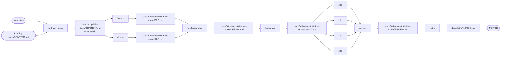

# blntrsz/skills

A workflow-oriented skill set for turning an idea into durable project context, initiative docs, implementation slices, review findings, and reusable learnings.

## Canonical documentation layout

```text
/docs/CONTEXT.md
/docs/LEARNINGS.md
/docs/adr/
/docs/initiatives/<initiative_name>/
  - PRD.md
  - RFC.md
  - DESIGN.md
  - issues/0001-issue-title.md
  - REVIEW.md
```

## Main workflow



## Workflow stages

1. **Grill and document the language** — `/grill-with-docs` stress-tests the idea against the codebase, sharpens terms into `docs/CONTEXT.md`, and records durable decisions in `docs/adr/` when warranted.
2. **Split product and proposal thinking** — `/to-prd` creates the business-facing `PRD.md`; `/to-rfc` creates the rationale/tradeoff-focused `RFC.md` for the same initiative.
3. **Turn intent into design** — `/to-design-doc` combines the PRD, RFC, ADRs, context, and codebase conventions into `DESIGN.md`.
4. **Slice implementation work** — `/to-issues` breaks the design into thin, independently grabbable vertical slices under `docs/initiatives/<initiative_name>/issues/`.
5. **Build with TDD** — `/tdd` implements each slice with red-green-refactor discipline and behavior-first tests.
6. **Review and learn** — `/review` writes strict local findings to `REVIEW.md`; `/retro` converts recurring feedback into durable `docs/LEARNINGS.md` entries.

## Skills

- `grill-me` — plain relentless design interview without documentation side effects.
- `grill-with-docs` — design interview plus `docs/CONTEXT.md` and `docs/adr/` updates.
- `to-prd` — writes `docs/initiatives/<initiative_name>/PRD.md`.
- `to-rfc` — writes `docs/initiatives/<initiative_name>/RFC.md`.
- `to-design-doc` — writes `docs/initiatives/<initiative_name>/DESIGN.md`.
- `to-issues` — writes `docs/initiatives/<initiative_name>/issues/0001-issue-title.md` and follow-on issue slices.
- `tdd` — implements slices using behavior-first red-green-refactor.
- `review` — writes `docs/initiatives/<initiative_name>/REVIEW.md`.
- `retro` — writes durable learnings to `docs/LEARNINGS.md` when lint/ast-grep cannot enforce them.
- `write-a-skill` — creates new skills with proper structure and progressive disclosure.
