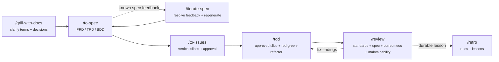

# blntrsz/skills

AI workflow skills for the `pi` coding agent. The goal is to move from a fuzzy idea to shipped code through a repeatable loop: clarify the domain, write the spec, slice the work, implement with tests, review hard, then turn lessons into guardrails.

## Target workflow



The image flow is the desired command sequence. In this repo, the boxes map to skills under [`skills/`](./skills/). Use `/iterate-spec` when specs already have feedback.

## Flow by phase

| Phase | Skill / command | Purpose | Main output |
|---|---|---|---|
| 1 | [`/grill-with-docs`](./skills/grill-with-docs/SKILL.md) | Relentlessly clarify the idea against existing code/docs, sharpen terminology, update `CONTEXT.md`, and create ADRs only for durable decisions. | Shared understanding, glossary updates, ADRs. |
| 2 | [`/to-spec`](./skills/to-spec/SKILL.md) | Synthesize the clarified plan into the right spec set: PRD, TRD, BDD, or a combination. BDD is the behavioral source of truth. | `PRD.md`, `TRD.md`, and/or `features/<domain>/*.feature`. |
| 2a | [`/iterate-spec`](./skills/iterate-spec/SKILL.md) | When existing specs get feedback, resolve each theme through a focused clarification loop and regenerate the specs. | Updated specs with feedback traceability. |
| 3 | [`/to-issues`](./skills/to-issues/SKILL.md) | Break the spec into independently grabbable vertical tracer bullets, then iterate until the slice breakdown is approved. | Approved issue list or `docs/issues/*.md`. |
| 4 | [`/tdd`](./skills/tdd/SKILL.md) | Implement one approved issue at a time: approve the spec-derived behavior plan, then use red-green-refactor for one behavior at a time. | Minimal code + tests for one vertical slice. |
| 5 | [`/review`](./skills/review/SKILL.md) | Review the diff across documented standards, spec fit, correctness, and maintainability. Requested fixes flow back through `/tdd` until clean. | Prioritized findings and requested changes. |
| Optional | [`/retro`](./skills/retro/SKILL.md) | Convert repeated or durable feedback into guardrails: lint rules, ast-grep rules, or `docs/LESSONS.md`. | Automated rules or concise lessons. |

## Typical usage

```text
/grill-with-docs   # decide what we mean and what we are building
/to-spec           # capture the decision as PRD/TRD/BDD
/iterate-spec      # only when existing specs receive feedback
/to-issues         # propose slices and iterate until the breakdown is approved
/tdd               # approve the behavior plan, then red-green-refactor one slice
/review            # inspect the diff; requested fixes go back through /tdd
/tdd               # repeat for review fixes until clean
/retro             # optional: preserve durable lessons as guardrails
```

## Operating rules

- Specs are not final until feedback has either been accepted, rejected with rationale, or deferred with a condition/owner.
- Issues should be demoable vertical slices through all relevant layers and approved before implementation.
- Implementation should follow the spec, with BDD scenarios acting as the behavioral contract; `/tdd` starts by approving the behavior plan.
- Review findings flow back into `/tdd`; only durable review lessons flow into `/retro`.
- Prefer automated guardrails over prose when a lesson can be enforced precisely.

## Skills map

| Skill | Role |
|---|---|
| [`grill-me`](./skills/grill-me/SKILL.md) | Lightweight planning interview without documentation updates. |
| [`grill-with-docs`](./skills/grill-with-docs/SKILL.md) | Clarification plus glossary/ADR maintenance. |
| [`to-spec`](./skills/to-spec/SKILL.md) | Generate PRD/TRD/BDD from resolved context. |
| [`iterate-spec`](./skills/iterate-spec/SKILL.md) | Spec-feedback loop that resolves review comments and regenerates specs. |
| [`to-issues`](./skills/to-issues/SKILL.md) | Convert specs/plans into vertical implementation issues. |
| [`tdd`](./skills/tdd/SKILL.md) | Test-driven implementation of one vertical slice at a time. |
| [`review`](./skills/review/SKILL.md) | High-signal standards/spec/correctness/maintainability review. |
| [`retro`](./skills/retro/SKILL.md) | Turn feedback into durable rules or lessons. |
