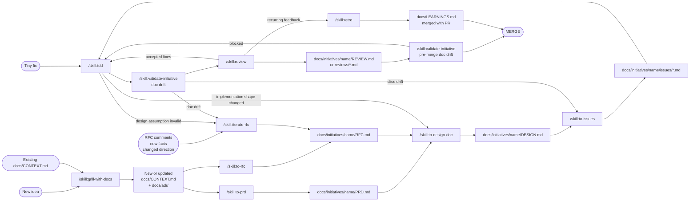

# blntrsz/skills

A workflow-oriented skill set for turning an idea into durable project context, initiative docs, implementation slices, review findings, doc-drift evidence, and reusable learnings.

## Usage

These are standard Agent Skill packages under `skills/<name>/SKILL.md`.

In Pi, invoke them as `/skill:<name>` unless you have separate slash-command aliases configured. This README uses the explicit `/skill:<name>` form.

Validate the skill package structure with:

```bash
python3 scripts/validate-skills.py
```

## Canonical documentation layout

```text
/docs/CONTEXT.md
/docs/LEARNINGS.md
/docs/adr/
/docs/initiatives/<initiative_name>/
  - PRD.md
  - RFC.md
  - DESIGN.md
  - VALIDATION.md
  - REVIEW.md                 # rollup / current review summary
  - issues/0001-issue-title.md
  - reviews/0001-issue-title.md
```

Create files lazily. Tiny fixes can skip initiative documents entirely and start at TDD, but should still use appropriate validation and review before merge.

## Route by risk

Use the lightest workflow that still protects the change.

| Tier | Use when | Default path |
| --- | --- | --- |
| Tiny fix | Local, obvious, low-risk change | `/skill:tdd` → lightweight validation/review as needed |
| Small change | Clear requirement, limited surface area | issue or short design note → `/skill:tdd` → `/skill:validate-initiative` for doc drift → `/skill:review` |
| Initiative | Product-facing or cross-cutting work | full PRD/RFC/DESIGN/issues workflow |
| Hard-to-reverse initiative | Architecture, persistence, integration, or irreversible tradeoff | full workflow plus ADRs where warranted |

## Source-of-truth boundaries

| Artifact | Owns | Does not own |
| --- | --- | --- |
| `docs/CONTEXT.md` | Shared domain language and glossary | Requirements, proposals, implementation details |
| `docs/adr/` | Durable hard-to-reverse decisions | Routine local choices or task details |
| `PRD.md` | User requirements, business behavior, acceptance criteria | Proposed technical change, tradeoffs, implementation plan |
| `RFC.md` | Proposed change, decision rationale, tradeoffs, alternatives | User requirements, task breakdown, implementation steps |
| `DESIGN.md` | How to implement the accepted product/RFC direction | Business justification, alternative analysis, issue sequencing |
| `issues/*.md` | Thin implementation slices and acceptance/validation notes | New requirements or new decisions |
| `VALIDATION.md` | Doc-drift findings and consistency evidence | Code review findings or verification command results |
| `REVIEW.md` / `reviews/*.md` | Strict code-quality findings | Product requirements or validation reports |
| `docs/LEARNINGS.md` | Durable learnings to merge with the PR | One-off comments or chat-only memory |

## Main initiative workflow



## Workflow stages

1. **Route by size** — tiny fixes may skip PRD/RFC/DESIGN/issues and start at `/skill:tdd`; larger or risky changes should use the full initiative flow.
2. **Grill and document the language** — `/skill:grill-with-docs` stress-tests the idea against the codebase, sharpens terms into `docs/CONTEXT.md`, and records durable decisions in `docs/adr/` when warranted.
3. **Split product and proposal thinking** — `/skill:to-prd` creates the business-facing `PRD.md`; `/skill:to-rfc` creates the rationale/tradeoff-focused `RFC.md` for the same initiative.
4. **Iterate the RFC when reality changes** — `/skill:iterate-rfc` updates the RFC after comments, new information, design drift, or switching to an alternative solution.
5. **Turn intent into design** — `/skill:to-design-doc` combines the PRD, RFC, ADRs, context, and codebase conventions into `DESIGN.md`.
6. **Slice implementation work** — `/skill:to-issues` breaks the design into thin, independently grabbable vertical slices under `docs/initiatives/<initiative_name>/issues/`. If a slice needs a decision, mark the blocker in the issue instead of inventing an answer.
7. **Build with TDD** — `/skill:tdd` implements each slice with red-green-refactor discipline and behavior-first tests. When given a clear issue file, the issue is the approval contract; ask only for missing or contradictory requirements.
8. **Validate doc drift before and after review** — `/skill:validate-initiative` records whether PRD, RFC, DESIGN, issues, context, ADRs, and implementation evidence still agree in `VALIDATION.md`.
9. **Review, fix, and re-check** — `/skill:review` writes strict local findings. Accepted findings loop back through TDD/fix work, then validation and review repeat as needed.
10. **Merge learnings with the PR** — `/skill:retro` converts recurring feedback into durable `docs/LEARNINGS.md` entries when lint/ast-grep cannot enforce them. These learnings should be committed with the PR that produced them.

## Skills

- `grill-me` — plain relentless design interview without documentation side effects.
- `grill-with-docs` — design interview plus `docs/CONTEXT.md` and `docs/adr/` updates.
- `to-prd` — writes `docs/initiatives/<initiative_name>/PRD.md`.
- `to-rfc` — writes `docs/initiatives/<initiative_name>/RFC.md`.
- `iterate-rfc` — revises an RFC after comments, new information, design changes, or switching alternatives.
- `to-design-doc` — writes `docs/initiatives/<initiative_name>/DESIGN.md`.
- `to-issues` — writes `docs/initiatives/<initiative_name>/issues/0001-issue-title.md` and follow-on issue slices.
- `tdd` — implements slices using behavior-first red-green-refactor.
- `validate-initiative` — records doc-drift and consistency evidence across initiative docs, context, ADRs, and implementation evidence in `VALIDATION.md`.
- `review` — writes strict local findings to `REVIEW.md` or per-slice `reviews/*.md`.
- `retro` — writes durable learnings to `docs/LEARNINGS.md` when lint/ast-grep cannot enforce them.
- `write-a-skill` — creates new skills with proper structure and progressive disclosure.
